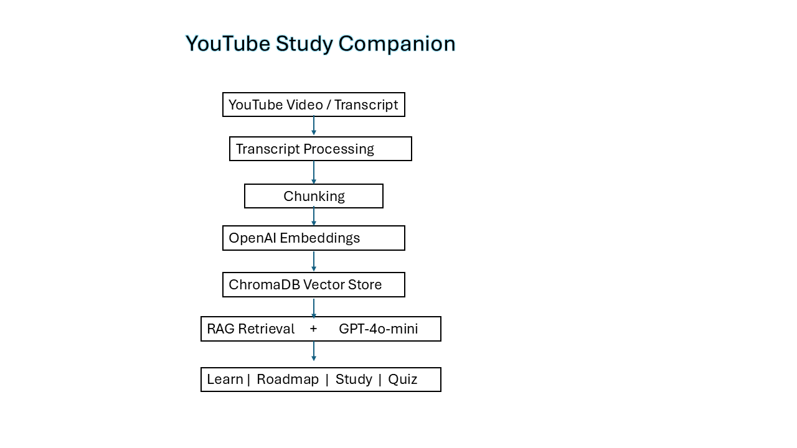

# youtube-study-companion
A RAG-powered learning assistant that transforms long YouTube videos into searchable learning resources.

## Live Demo

### Hugging Face Space:

[Try the application on Hugging Face](https://huggingface.co/spaces/GayatriRajagopalan/youtube-study-companion)

The application extracts video transcripts, builds a vector database using OpenAI embeddings and ChromaDB, and allows users to explore content through question answering, topic roadmaps, study packs, and quizzes.

## Features
YouTube transcript extraction

Transcript paste fallback for cloud-hosted deployments

Semantic search using OpenAI embeddings

ChromaDB vector database

RAG-based question answering

Video roadmap generation

Study pack generation

Quiz generation

Interactive Gradio interface

Demo Video

## Watch the project demo:

See the project in action:

[Demo Video](assets/demo.mp4)

## Architecture

## Tech Stack
Python
OpenAI API
ChromaDB
Gradio
YouTube Transcript API
Pydantic

## Project Structure

youtube-study-companion/

├── youtube_study_companion_v3.ipynb

├── requirements.txt

├── README.md

└── assets/

    ├── demo.mp4

    └── architecture.png

## Known Limitations
YouTube may block transcript retrieval requests originating from cloud-hosted environments such as Hugging Face Spaces. If transcript extraction fails, please refer to the GitHub repository and run the application locally.
For pasted transcripts, timestamps are estimated because the current implementation does not process the original transcript timestamps.
## Future Enhancements

Multi-video knowledge base

Personalized learning paths

Agentic learning workflows

Learning progress tracking

Automatic transcript timestamp preservation for pasted transcripts

## Author

Gayatri Rajagopalan

LinkedIn: https://www.linkedin.com/in/gayatri-rajagopalan-99121229/

GitHub: https://github.com/GayatriRajagopalan